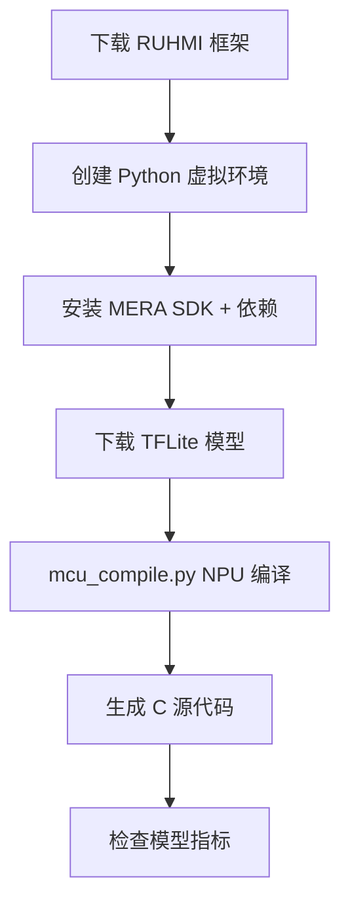

# RUHMI — MNIST 模型编译部署工作区

基于 [RUHMI Framework AI MCU Compiler](https://github.com/renesas/ruhmi-framework-mcu) 的自动化工作区，用于将 AI 模型（以 LeNet-5 MNIST 为例）编译为可在 Renesas RA8P1 MCU（搭载 Arm Ethos-U55 NPU）上运行的 C 源代码。

## 项目结构

```
ruhmi/
├── build.sh                    # Linux/macOS 一键构建脚本（bash）
├── justfile                    # Windows 一键构建脚本（PowerShell + just）
├── .gitignore                  # 忽略 models/、ruhmi-framework-mcu/、deploy_output/
├── models/                     # 存放待编译的 TFLite 模型
│   └── lenet5_int8_mnist.tflite
├── ruhmi-framework-mcu/        # RUHMI 框架（由 build.sh 自动 clone）
│   ├── scripts/                # 编译脚本 mcu_compile.py
│   ├── install/                # MERA SDK wheel 包（Linux/Windows）
│   ├── docs/                   # 文档、教程、API 参考
│   ├── application_examples/   # 人脸检测、图像分类示例工程
│   └── .venv/                  # Python 虚拟环境（自动创建）
└── deploy_output/              # 编译产物输出目录
    └── lenet5_int8_mnist_NPU/  # NPU 编译结果
        └── build/MCU/compilation/src/  # 生成的 C 源代码
```

## 快速开始

### 前置条件

| 要求 | Linux | Windows |
|------|-------|---------|
| OS | Ubuntu 22.04（推荐） | Windows 10/11 |
| Python | 3.10.x | 3.10.x |
| 工具 | git、curl | git、curl |
| 附加 | — | PowerShell、[just](https://github.com/casey/just) |

### Linux / macOS

```bash
# 一键执行全流程：下载框架 → 创建虚拟环境 → 下载模型 → 编译 → 检查指标
./build.sh all

# 或分步执行
./build.sh download-ruhmi   # 1. 克隆 RUHMI 框架
./build.sh setup             # 2. 创建 venv 并安装依赖
./build.sh download-model    # 3. 下载 LeNet-5 MNIST INT8 模型
./build.sh convert           # 4. NPU 编译
./build.sh metrics           # 5. 检查模型指标
```

### Windows

```powershell
# 一键执行全流程
just all

# 或分步执行
just download-ruhmi
just setup
just download-model
just convert
just metrics
```

## 工作流程



## 编译产物

编译完成后，生成的 C99 源代码位于：

```
deploy_output/lenet5_int8_mnist_NPU/build/MCU/compilation/src/
├── model.c / model.h               # 模型入口
├── sub_0000_invoke.c / .h          # 推理调用
├── sub_0000_model_data.c / .h      # 模型权重数据
├── sub_0000_tensors.c / .h         # 张量定义
├── sub_0000_command_stream.c / .h  # NPU 命令流
├── hal_entry.c                     # 硬件抽象层入口
└── ethosu_common.h                 # Ethos-U 公共头文件
```

这些文件可直接导入 Renesas e² studio 工程，在 RA8P1 开发板上运行推理。

## 目标硬件

- **Renesas EK-RA8P1** — Cortex-M85 + Ethos-U55 NPU
- **Renesas RA8xx 系列** — 无 NPU 的纯 CPU 部署

## 文档索引

| 文档 | 说明 |
|------|------|
| [RUHMI 框架 README](ruhmi-framework-mcu/README.md) | 框架总览与完整安装指南 |
| [编译脚本说明](ruhmi-framework-mcu/scripts/README.md) | `mcu_compile.py` 参数与用法 |
| [生成代码指南](ruhmi-framework-mcu/docs/runtime_api.md) | 如何在 e² studio 中使用生成的 C 代码 |
| [模型测试列表](ruhmi-framework-mcu/docs/models_tested.md) | 已验证的模型清单 |
| [算子支持](ruhmi-framework-mcu/docs/operator_support.md) | 各框架支持的算子 |
| [教程](ruhmi-framework-mcu/docs/tutorials/README.md) | Jupyter Notebook 实战教程 |

## 许可证

- RUHMI Framework AI MCU Compiler：[Apache License 2.0](ruhmi-framework-mcu/LICENSE.md)
- MERA SDK：Apache License 2.0
- 生成的 C 源代码中包含独立的版权声明，请查看各文件头部
